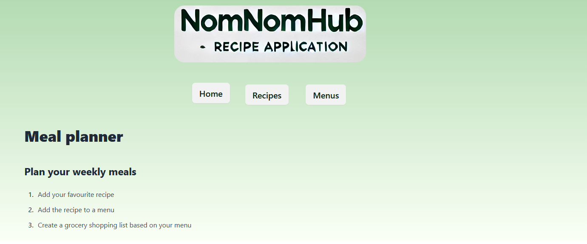
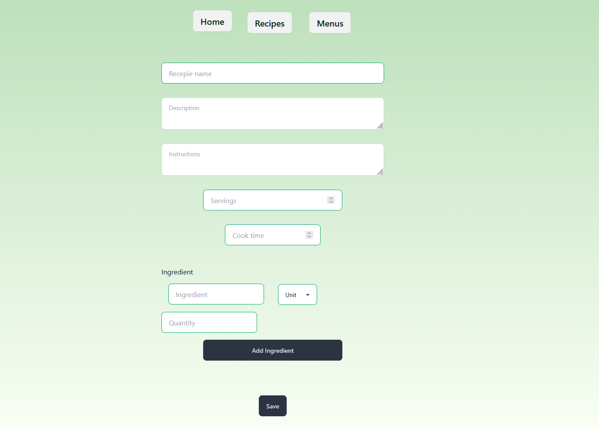
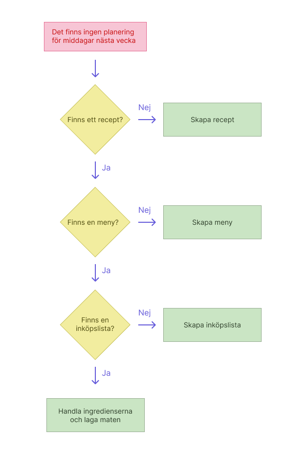

## NomNomHub

This project is a full-stack application built in Vite, React and with a postgres database. Tests are written in Cypress. 

The project idea is that you add recipes, which you can then add to menus. 

Below, you'll find detailed instructions for setting up and running the project in a local environment.

## Project Structure

    project/
    ├── backend/
    ├── frontend/
    ├── README.md

Make sure you have the following installed:

- **Node.js**
- **npm** or **yarn**
- **PostgreSQL** (for the database)

---

## Local Setup

### Navigate to the `backend/` directory and install dependencies:

    cd backend
    npm install

Set up a .env file in the backend/ directory with the following variable:

PGURI_LOCAL=your_database_connection_string

### Navigate to the frontend/ directory and install dependencies:

    cd ../frontend
    npm install

Running the Project Locally
Start the backend:

Navigate to the backend/ directory and run:

    cd backend
    npm run dev

This will start the backend server locally.
Start the frontend:

Navigate to the frontend/ directory and run:

    cd frontend
    npm run build
    npm run preview

This will build and preview the frontend locally.

## Tests

To run tests with Cypress navigate to the frontend directory and start Cypress:

    cd frontend
    npx cypress open
